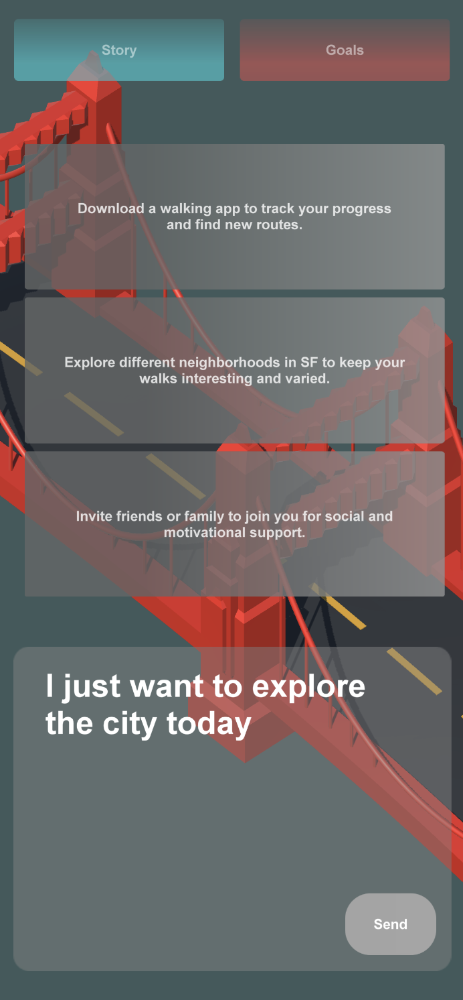
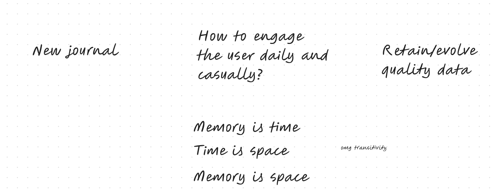
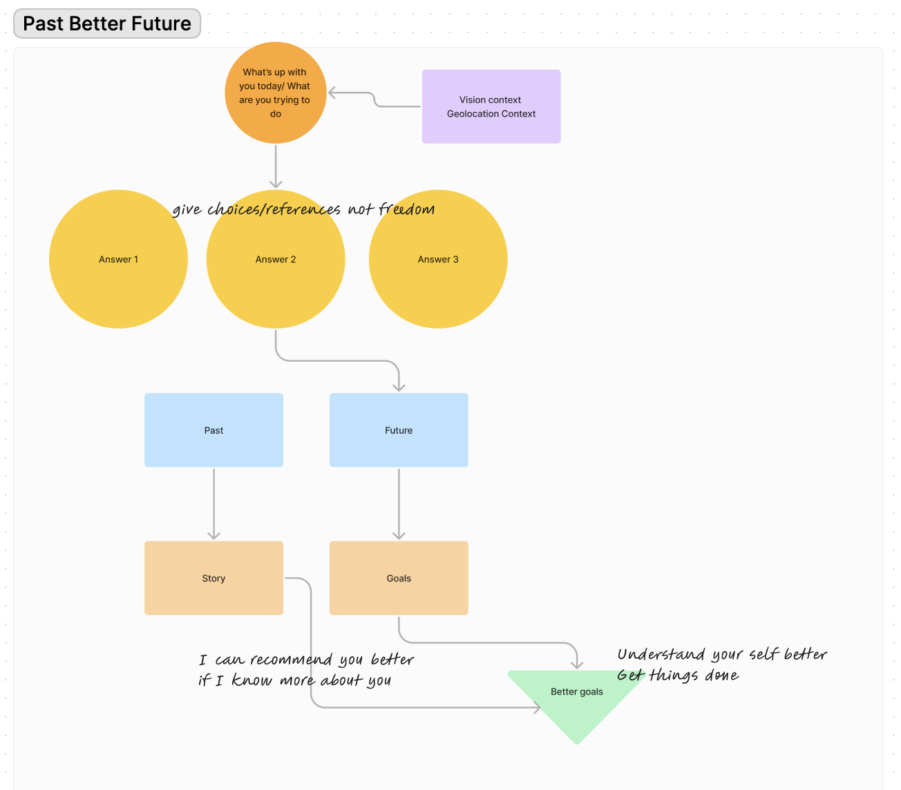

# newjournal

An interactive mobile application to augment future using your past.

In this simple iOS app, the user casually inputs some thoughts regarding the "goal of the day" or long term goal. The app subdivides the thoughts from past to future. The Future is affected from the past to make better decision. This is supposed to be a long term utilization of the app and highly contextual based on location and vision. Highly inspired from new computer and new way to interact with our smart devices. 

This was fun! 
Made during 
https://lu.ma/taa6ijxt
